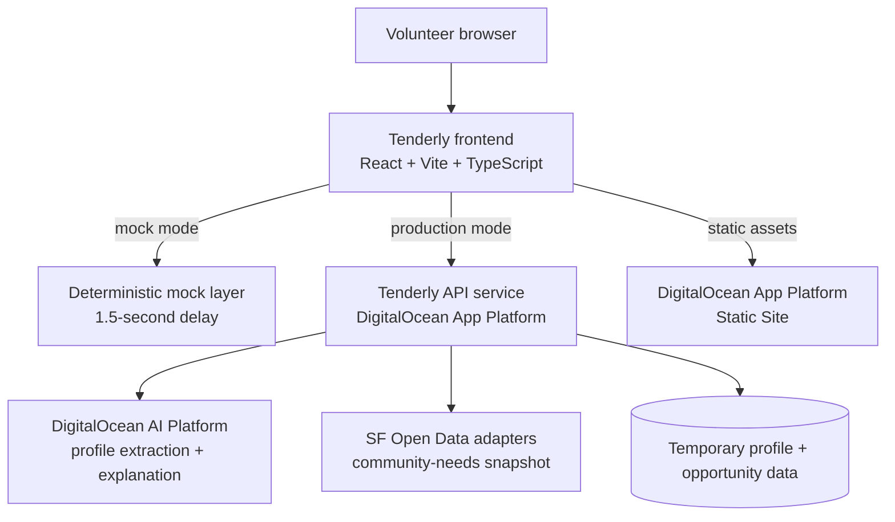
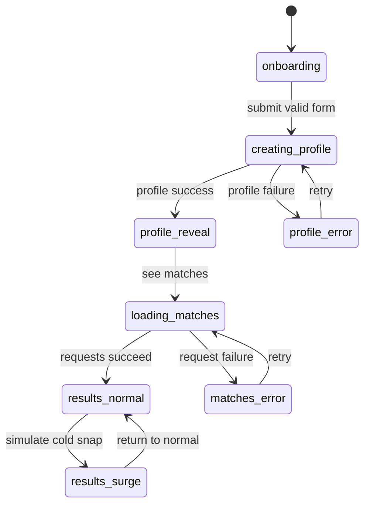

# Architecture

## System view



## Architectural decisions

| Decision | Choice | Why |
| --- | --- | --- |
| Frontend | React, Vite, TypeScript, Tailwind CSS, Framer Motion | Fast iteration with typed data boundaries, responsive styling, and stable layout animation. |
| Navigation | One continuous page; no router | The main journey is linear, and the demo benefits from zero route transitions. |
| API boundary | Small REST client with mock/real implementations | Backend can be built in parallel without branching the UI code. |
| AI boundary | Backend only | API keys and resume handling never belong in browser code. |
| Hosting | DigitalOcean App Platform static site for frontend; App Platform service for API | Satisfies the sponsor-platform story while keeping deployment simple. |
| Data freshness | Backend fetches/caches normalized SF data | Prevents browser CORS/rate-limit complexity and makes the re-ranker testable. |
| Persistence | Ephemeral for demo; no auth | Reduces privacy risk and keeps scope aligned with the hackathon. |

## Frontend module plan

```text
src/
  api/
    types.ts          # Contract-shaped TypeScript types
    mock.ts           # 1.5s fake responses; no network access
    client.ts         # Fetch implementation against VITE_API_URL
    index.ts          # Exports the active implementation from VITE_USE_MOCK
  components/
    Hero.tsx
    OnboardingForm.tsx
    UploadDropzone.tsx
    CauseChips.tsx
    AvailabilityControl.tsx
    ProfileLoading.tsx
    ProfileReveal.tsx
    MatchCard.tsx
    MatchList.tsx
    CommunityPulse.tsx
    ScenarioControl.tsx
    AsyncState.tsx
  hooks/
    useProfileFlow.ts
    useReducedMotion.ts
  lib/
    format.ts
    constants.ts
  App.tsx
  main.tsx
  index.css
```

## State model



Keep profile, matches, needs, scenario, and request status in one page-level flow hook. Presentational components receive typed data and callbacks; they do not fetch independently. This prevents inconsistent loading/error states and makes the demo state reproducible.

## Security and privacy

- The browser sends a resume only to `POST /api/profile` over HTTPS in production.
- Do not ship AI credentials, public-data credentials, raw resumes, or PII in Vite environment variables. `VITE_*` variables are public by design.
- Do not log upload contents, parsed resume fields, or generated explanation text to third-party analytics.
- Set backend file-size/type validation; the UI accept filter is usability only, not security.
- Configure backend CORS to the deployed frontend domain only. During development, permit the Vite development origin.
- For the demo, explain that profiles are session-scoped and are not used to make eligibility or hiring decisions.

## Failure boundaries

| Failure | User experience | Technical recovery |
| --- | --- | --- |
| Profile extraction fails | Friendly explanation + retry; preserve selections and file name. | Retry POST; mock mode remains available for the demo. |
| Needs source fails | Matches remain usable with “Community pulse is temporarily unavailable.” | Backend serves a recent cached normalized snapshot when possible. |
| Match request fails | No blank area; clear retry. | Retry only the failed match request. |
| AI explanation fails | Render safe deterministic explanation fallback. | Return `why_you: null`; do not fail the entire match response. |
| Frontend deployment fails | Use local Vite preview as last-resort demo. | Redeploy last known-good build; keep environment configuration documented. |
