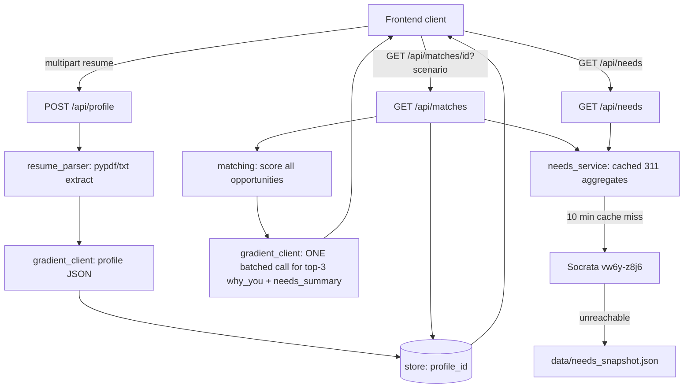

# Backend architecture

## Module layout

```text
app/
  main.py            # FastAPI app, CORS, the four routes
  config.py           # env vars: GRADIENT_*, SOCRATA_*, cache TTL
  models.py           # pydantic v2 response/request schemas (contract-exact)
  store.py            # in-memory profile_id -> profile dict
  resume_parser.py     # pypdf/txt extraction + fallback profile builder
  gradient_client.py   # OpenAI-compatible client wrapper, JSON hardening
  matching.py          # pure scoring function + ranking orchestration
  needs_service.py      # Socrata fetch, 10-min cache, snapshot fallback
data/
  opportunities.json    # 18 seeded nonprofit opportunities
  needs_snapshot.json    # bundled fallback if Socrata is unreachable
tests/
  fixtures/sample_resume.txt
  test_matching.py
scripts/
  smoke.sh
```

## Request flow



## Scoring model (matches `AI-AND-DATA.md` exactly)

```text
base_score =
  0.45 * skills_overlap +
  0.25 * cause_alignment +
  0.20 * availability_fit +
  0.10 * neighborhood_relevance

final_score = clamp(base_score + scenario_needs_boost, 0, 1)
```

- `skills_overlap` / `cause_alignment`: fraction of the opportunity's `needed_skills`/`causes` present in the profile, with substring credit for near-matches (e.g. profile skill `"driving"` vs opportunity `"valid driver's license"`).
- `availability_fit`: 1.0 on an exact/keyword match, 0.85 if the opportunity accepts `"flexible"`, 0.6 on partial keyword overlap, 0.25 otherwise. Treated as an opaque string so it works whether the frontend sends `"weekends"` or `"one_time"`/`"weekly"`/`"flexible"` (see Assumptions).
- `neighborhood_relevance`: normalized 311 case density for the opportunity's neighborhood in the current 7-day window (0–1, this is the "community urgency" signal from live data).
- `scenario_needs_boost`: 0 in `scenario=normal`. In `scenario=surge`, adds an extra weighted boost to opportunities whose `category` is `food_security` or `homelessness`, scaled by that neighborhood's `Encampments`-tagged case share — this is what visibly reorders the list and is described in plain language via `needs_summary`.
- `urgency` label (`low`/`medium`/`high`) buckets the same 0–1 urgency signal used in `neighborhood_relevance` + scenario boost, independent of `score`, per the contract's separate `urgency` field.

## Gradient AI usage (2 calls per full user journey)

1. **Profile extraction** (`POST /api/profile`): resume text + interests + availability → strict JSON `{name, skills, experience_summary, causes}`.
2. **Batched explanation + summary** (`GET /api/matches`): top-3 opportunities + profile + needs context → strict JSON `{needs_summary, why_you: {opportunity_id: text}}` in one call, per the task's "batch into ONE call" requirement.

Every call: strip markdown fences → `json.loads` in `try/except` → retry once → deterministic fallback on second failure. Latency logged per call. This guarantees the demo never 500s even if Gradient AI is rate-limited or down.

## Needs pipeline

- Query `vw6y-z8j6` filtered to `requested_datetime` in the last 7 days, `$limit=500`.
- Normalize `neighborhoods_sffind_boundaries` (title-case + strip) before grouping — the raw data has case-duplicate neighborhood names.
- Cache the aggregated result in memory for 10 minutes; on fetch failure, serve `data/needs_snapshot.json` and mark it as such internally (still returns the same `NeedsResponse` shape).
- Seed opportunity neighborhoods use Socrata's exact spellings so the urgency join needs no translation table.

## Assumptions this backend makes (see also root `ASSUMPTIONS.md`)

| Open question from frontend docs | Backend decision |
| --- | --- |
| `interests` serialization (`ASSUMPTIONS.md` flags comma string vs JSON array as unresolved) | Accept both: try `json.loads` first if the value looks like a JSON array, else split on comma. |
| `availability` vocabulary (`REQUIREMENTS.md` implies `one_time`/`weekly`/`flexible`; this task's contract example shows `"weekends"`/`"weekday evenings"`) | Treat as an opaque string and match by keyword/substring rather than a fixed enum, so either vocabulary scores sensibly. |
| Cause vocabulary | `REQUIREMENTS.md`'s ~10 chips and the `impact-profile-screen.png` mockup's chips disagree with each other (`climate` vs `"Climate Action"`, no `"Education Access"`/`"Digital Literacy"` in the doc list). Since causes are free text either way, seed data's `causes` vocabulary is the union: `food security, housing, youth, seniors, climate/climate action, health, disability inclusion, animal welfare, immigrant support, community safety, education access, digital literacy`. |
| Seed org naming | `Code Tenderloin` and `GLIDE` recur across the assistant/dashboard/map mockups (`docs/BACKEND-PLAN.md` design assets review) — used verbatim in `opportunities.json` instead of generic placeholders. |
