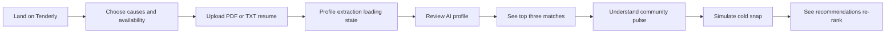

# Product requirements

## User journey

## Functional requirements

### Landing and onboarding

- Display the hero statement: “Millions want to help. Tenderly finds where **you** matter most.”
- Provide one primary CTA that brings focus/scroll position to the onboarding form.
- Accept a PDF or TXT resume by drag-and-drop or click-to-browse.
- Do not require a file solely to make the demo usable: provide an explicit “Try with sample profile” control.
- Offer multi-select cause chips from approximately ten categories: food security, housing, youth, seniors, climate, health, disability inclusion, animal welfare, immigrant support, and community safety.
- Offer a keyboard-operable segmented availability control. Values are `one_time`, `weekly`, and `flexible` internally; the visible labels are human-readable.
- Prevent submission until either an allowed file is selected or the sample-profile option is chosen, at least one cause is selected, and availability is selected. State the recovery action in the validation copy.

### Profile reveal

- On submission, call `createProfile` and show a non-blocking loading state with rotating messages.
- Messages include “Reading your experience…”, “Finding your strengths…”, and “Scanning what SF needs right now…”.
- Once complete, reveal name, summary, skills, causes, and stated availability.
- Offer a clear “See your matches” control; do not force a timed transition.

### Matches and community pulse

- Request normal matches and community needs after profile creation.
- Render the first three matches as rich cards, ordered by API response.
- Render remaining matches in a compact “Also good fits” list.
- Every top card includes organization, title, category, neighborhood, commitment, urgency label, numeric match percentage, and `why_you` explanation.
- Treat a missing `why_you` as valid: show a concise fallback (“A strong fit based on your skills, availability, and the organization’s current needs.”).
- Render a Community pulse with `needs_summary`, `updated_at`, and a concise neighborhood list.
- Provide a prominent toggle/button labelled “Simulate: cold snap hits SF”. It calls the same match endpoint with `scenario=surge`.
- In surge mode, preserve each opportunity identity and use layout animation to communicate a re-order. Add plain-language status text explaining what changed.
- Make the match update available through an `aria-live="polite"` region.

### Reliability requirements

- Never leave the user on a blank screen.
- Every async area has loading, empty, error, and retry behavior.
- Use mocked responses by default until `VITE_USE_MOCK=false` deliberately enables the backend.
- Artificial mock latency is 1.5 seconds so loading states are testable.

## Non-functional requirements

| Area | Requirement |
| --- | --- |
| Performance | Initial page should feel responsive on a mid-range mobile device; defer map dependencies and avoid blocking animation. |
| Readability | Use a 16px minimum body font, spacious line-height, clear heading hierarchy, and short paragraphs. |
| Accessibility | Meet WCAG 2.2 AA intent for contrast, focus visibility, semantics, labels, keyboard operation, and motion preferences. |
| Privacy | Do not persist resumes or display raw resume text in the frontend. Use sample/demo data only in mock mode. |
| Observability | Log client-side failures without logging resume content or generated profile details. |
| Compatibility | Support current evergreen Chrome, Safari, Firefox, and Edge at 375px and 1440px widths. |

## Acceptance checklist

- [ ] A keyboard-only visitor can upload/select a file, choose chips and availability, submit, and trigger the surge scenario.
- [ ] Every form control has a programmatic label and visible focus treatment.
- [ ] Urgency is communicated by text as well as color.
- [ ] Scores are exposed as a percentage in text, not ring/bar graphics alone.
- [ ] Animations respect `prefers-reduced-motion`.
- [ ] A failed profile, matches, or needs request shows a friendly retry action.
- [ ] `npm run build` creates `dist/` without TypeScript or lint errors.
- [ ] The deployed frontend has `VITE_API_URL` configured for production and uses a compatible backend CORS policy.
